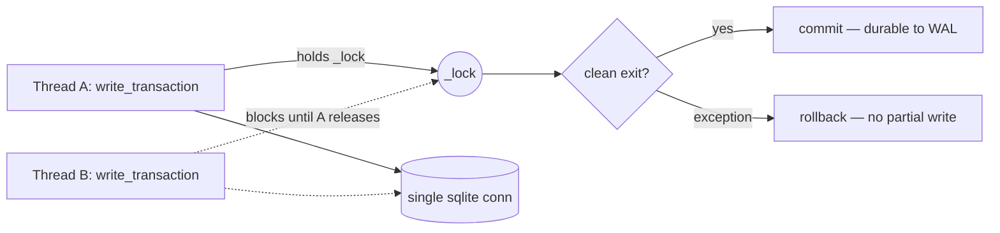

# Traceforge Persistence Durability — Design & Guarantees

Scope: `src/traceforge/governance/persistence.py::SystemStore`, the synchronous durability layer under governance session state. This document is the normative statement of *what durability the store already provides* and *how each guarantee is enforced and proven*. It documents shipped behavior; it introduces no new mechanism.

An upstream consumer requested a "durable persistence engine (WAL, single-writer, migrations)". That engine already exists as `SystemStore`. This document validates that it meets those acceptance criteria and cites the exact mechanism (file:line) and the test that proves each one.

---

## Storage model

`SystemStore` is a thin, synchronous durability layer over a **single SQLite connection** opened with `check_same_thread=False` (persistence.py:98). On construction, before any migration runs, it sets three pragmas (persistence.py:103-105):

```
PRAGMA journal_mode = WAL       # write-ahead logging: readers never block the writer
PRAGMA busy_timeout = 5000      # 5s wait on a locked DB before raising SQLITE_BUSY
PRAGMA synchronous = NORMAL     # fsync at WAL checkpoints, not every commit
```

* **WAL** gives us durable commits without a rollback journal: a committed transaction is appended to the `-wal` file and survives process death; a reader on a separate connection sees a consistent snapshot and is never blocked by an in-flight writer.
* **`synchronous = NORMAL`** is the correct pairing with WAL: commits are durable across an *application* crash (the WAL is flushed), trading only the extremely narrow window of an OS/power loss between checkpoints — the standard, recommended WAL durability posture, not full `FULL` fsync-per-commit overhead.
* **`busy_timeout`** bounds contention from any incidental second connection (e.g. a read-only reopen) rather than failing fast.

The schema itself is fully normalized from revision one — `budget_counters`, `taint_entries`, `mcp_profiles` + `mcp_profile_attributes`, plus scalar columns on `session_state` (0001_initial.py). There is no JSON-blob shape to migrate away from.

---

## Single-writer discipline

The pipeline is asyncio-single-threaded and offloads store writes to worker threads via `asyncio.to_thread`, so writes can *originate on different OS threads* even though they are never logically concurrent per session. An async primitive (`asyncio.Lock`/`Queue`) cannot serialize work that runs off-loop on arbitrary threads; the correct primitive for a synchronous store reached from many threads is a **`threading.Lock`** (persistence.py:84, :99).

```python
self._lock = threading.Lock()   # persistence.py:99 — non-reentrant, the one writer gate
```

Two write shapes, one gate:

1. **Single-statement writes** take the lock around `execute` + `commit` (e.g. `record_processed` persistence.py:167-172, `reserve_event` persistence.py:178-183, `store_content_hash` persistence.py:349-351).
2. **Multi-statement transactions MUST go through `write_transaction()`** (persistence.py:119-147) — the formal single-writer entry point. It holds `_lock` for the **entire** transaction (every statement the body issues, not merely the terminal commit), so two writers can never interleave statements on the shared connection.

```python
@contextmanager
def write_transaction(self):          # persistence.py:119-147
    with self._lock:                  # held for the WHOLE body
        try:
            yield self._conn
        except BaseException:
            self._conn.rollback()     # abort → nothing survives
            raise
        else:
            self._conn.commit()       # clean exit → atomic commit
```

### Non-reentrancy contract

`_lock` is a **non-reentrant** `threading.Lock` (not an `RLock`). Because `write_transaction` already holds it for the whole body, the body must issue its statements through the *no-lock* helpers — `execute_in_transaction` (persistence.py:363-365) and the `*_no_commit` methods (e.g. `write_mcp_profile_no_commit` persistence.py:242-272, `store_content_hash_no_commit` persistence.py:331-344). Calling a self-locking method (e.g. `commit`, persistence.py:367-370) from inside the body would deadlock. This is stated explicitly in the method contract (persistence.py:134-138) and is enforced by the lock's non-reentrancy: a same-thread re-acquire returns `False` / blocks, it does not silently pass as an `RLock` would.



---

## Transaction atomicity & crash recovery

`write_transaction` is all-or-nothing:

* **Commit** happens only on clean context exit; the multi-statement change lands as one atomic unit in the WAL.
* **Rollback** happens on *any* `BaseException` (persistence.py:143-145), then the exception re-raises — no dangling open transaction, no partial write.

Crash-recovery semantics follow directly from WAL + this discipline. We model a crash as **reopening a fresh `SystemStore` on the same file**: a brand-new process/connection with no cached state, so whatever the reopened store observes is exactly what was durably flushed.

* A **committed** `write_transaction` is visible after reopen (WAL durability).
* An **aborted** `write_transaction` leaves *nothing* — neither statement of a multi-statement body survives (atomic rollback), confirmed after reopen.
* An in-flight, uncommitted write is invisible to any separate connection (WAL snapshot isolation), so a concurrent reader never observes a dirty row.

---

## Versioned migrations

Schema is owned by Alembic migrations under `src/traceforge/migrations/`. On construction, after setting pragmas, `SystemStore` brings the database to HEAD (persistence.py:108 → `_run_alembic`).

* **Single source of truth, forward-only.** There is exactly one revision, `0001_initial` (versions/0001_initial.py: `revision = "0001_initial"`, `down_revision = None`). The latest revision is named once, in one place: `LATEST_REVISION = "0001_initial"` (versions/__init__.py:4), imported by the store (persistence.py:30). Because traceforge has never shipped, schema changes rewrite `0001_initial` rather than layering expand/backfill migrations — the old shape never exists.
* **Idempotent init with a fast path.** `_run_alembic` first checks `alembic_version` without importing SQLAlchemy; if it already equals `LATEST_REVISION` it returns immediately (persistence.py:33-37). Only a fresh or stale file takes the slow path that wraps the live connection in a SQLAlchemy engine and runs `command.upgrade(cfg, "head")` (runner.py:28-36). Reopening an up-to-date file re-applies nothing and never duplicates the stamped revision.
* **Concurrent first-run safe.** The migration creates tables with `CREATE TABLE IF NOT EXISTS` (0001_initial.py:29-30) so two processes racing to create a fresh `system.db` cannot crash each other.

---

## Acceptance criteria → evidence

Every acceptance criterion maps to a deterministic test. New validation lives in `tests/unit/test_persistence_durability.py` (barriers/events force contention with no wall-clock sleeps); pre-existing coverage in `tests/unit/test_governance_single_writer.py` and `tests/unit/test_governance_migrations.py` is cited where it already proves a criterion.

| Acceptance criterion | Guarantee | Mechanism (file:line) | Proof (test) |
| --- | --- | --- | --- |
| **Durable storage model** | WAL journal, `synchronous=NORMAL`, `busy_timeout=5000` are actually in force | persistence.py:103-105 | `test_persistence_durability.py::TestStorageModel` (`test_journal_mode_is_wal`, `test_synchronous_is_normal`, `test_busy_timeout_is_set`) |
| **Concurrent-writer safe** (no lost updates) | Whole-transaction writer lock serializes overlapping read-modify-write; final total is exact | persistence.py:99, :140 | `TestConcurrentWriterSerialization::test_barrier_forced_rmw_never_loses_updates`; also pre-existing `test_governance_single_writer.py::...::test_read_modify_write_never_loses_updates` |
| **Concurrent-writer safe** (no interleaving / no dirty read) | Second writer cannot enter while the first holds an open transaction; uncommitted rows are invisible cross-connection | persistence.py:140-147 | `TestConcurrentWriterSerialization::test_second_writer_cannot_enter_while_first_holds_transaction` |
| **Non-reentrancy contract** | `_lock` is a plain `threading.Lock`; the body uses `*_no_commit` helpers and never re-locks | persistence.py:99, :134-138 | `TestNonReentrancyContract` (`test_writer_lock_is_non_reentrant`, `test_write_transaction_holds_lock_across_whole_body`, `test_in_transaction_helpers_do_not_relock`) |
| **Crash-safe** (durability) | A committed transaction survives a fresh `SystemStore` reopen on the same file | persistence.py:140-147, :103 | `TestCrashSafetyAtomicity::test_committed_write_survives_fresh_store_reopen`; `test_multi_statement_commit_is_all_or_nothing_across_reopen` |
| **Crash-safe** (atomic rollback) | An aborted mid-transaction write leaves no partial state behind | persistence.py:143-145 | `TestCrashSafetyAtomicity::test_aborted_transaction_leaves_no_partial_write_after_reopen`; pre-existing `test_governance_single_writer.py::...::test_rolls_back_and_reraises_on_exception` |
| **Migratable / idempotent** | Fresh file migrates to `LATEST_REVISION`; reopening applies nothing and never double-stamps | persistence.py:30, :33-37, :108; runner.py:28-36; versions/__init__.py:4 | `TestMigrationIdempotence` (`test_fresh_file_is_migrated_to_latest_revision`, `test_reopen_applies_migration_exactly_once`, `test_reopen_is_a_clean_noop`); pre-existing `test_governance_migrations.py::TestInitialSchema` |

---

## Non-goals & boundaries

* **Not multi-process write concurrency.** The durability contract is single-writer *within one process*, reached from many threads. Cross-process writers are out of scope; `busy_timeout` merely keeps an incidental second connection from failing fast.
* **Not power-loss `FULL` durability.** `synchronous=NORMAL` is the deliberate WAL pairing (application-crash durable). Raising to `FULL` would be a policy change, not a bug fix, and is not part of these criteria.
* **Not a new engine.** This is a validation-and-documentation pass. No production logic, schema, or migration was changed to satisfy these criteria — the guarantees above are properties of the already-shipped `SystemStore`.
